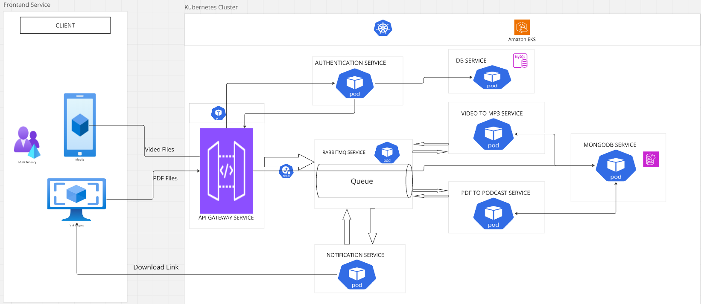

# Microservices Architecture

This project demonstrates a microservices architecture. It includes multiple services that communicate with each other to form a complete application within a kubernetes cluster. The services included in this project are:

- **[Authentication Service](https://github.com/Prosperibe12/microservice-auth)**: Manages user registration and authentication routes.
- **[Gateway Service](https://github.com/Prosperibe12/gateway-service)**: Manages the routing of requests to the appropriate services.
- **[RabbitMQ Service](https://github.com/Prosperibe12/rabbitmq-service)**: Handles messaging between services.
- **[MongoDB Service](https://github.com/Prosperibe12/mongodb-service)**: Manages MongoDB database operations.
- **[DB Service](https://github.com/Prosperibe12/postgres-service)**: Manages the database operations.
- **[Notification Service](./notification_service/README.md)**: Sends notifications to users.
- **[Video to MP3 Service](https://github.com/Prosperibe12/converter-service)**: Converts video files to MP3 format.
- **[PDF to Podcast Service](./pdf_to_podcast_service/README.md)**: Converts PDF documents to intuitive podcast style audio.

## Overview

This system provides a seamless pipeline for media processing, enabling users to convert videos to MP3 and PDFs into AI-generated podcasts. The API Gateway handles user requests and routes it to the appropriate service.

- **Video to MP3 Conversion**: Users upload video files, which are placed in a queue via **RabbitMQ Service**. The **Video to MP3 Converter** service converts the video to mp3 and pushes the message to the queue. The new message is consumed by the notification service which sends a download link to the user.  
- **PDF to Podcast Conversion**: Users submit PDF files, which are routed to the **PDF to Podcast Converter** service. This service generates a two-person AI-narrated podcast and pushes a message to the **RabbitMQ Service**, this message is consumed by the **Notification service** which sends a notification to the user with a download link.  
- **Media Storage & Retrieval**:  
  - The **MongoDB Service** stores video & mp3 files, ensuring efficient access and management for seamless processing and retrieval of large files.  
  - The **PostgreSQL Database** is used for **user management and authentication**, ensuring secure access to the system.  

All services run within a **Kubernetes cluster**, leveraging containerized microservices to ensure **scalability, fault tolerance, and efficient resource management**.  

## Architecture

The above diagram illustrates the architecture of the microservices in this project.

## Technologies 

### **Programming Languages & Frameworks**  
- Python  
- Django Rest Framework  
- Flask  

### **Databases & Messaging**  
- PostgreSQL (User management & authentication)  
- MongoDB (Media storage & retrieval)  
- RabbitMQ (Asynchronous task queuing)  

### **Infrastructure & Deployment**  
- Docker  
- Kubernetes 

## Getting Started

To get started with this project, follow these steps:

1. Clone the repository.
2. Navigate to the project directory.
3. Follow the instructions in each service's README to set up and run the services.

## Contact

For any questions or inquiries, please contact [Prosperibe12@gmail.com](mailto:Prosperibe12@gmail.com).